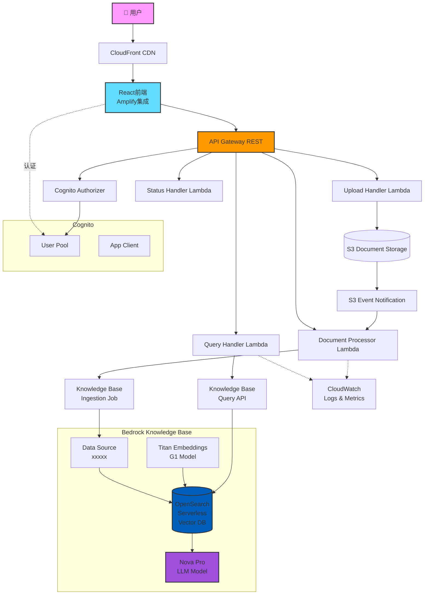
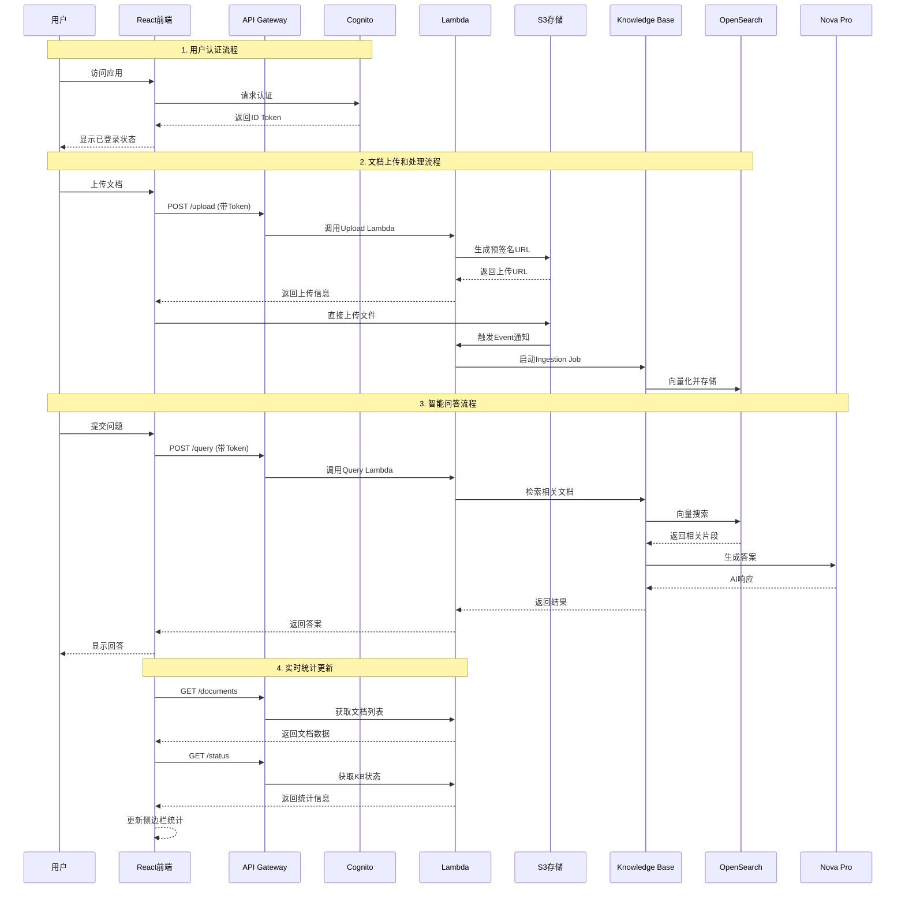
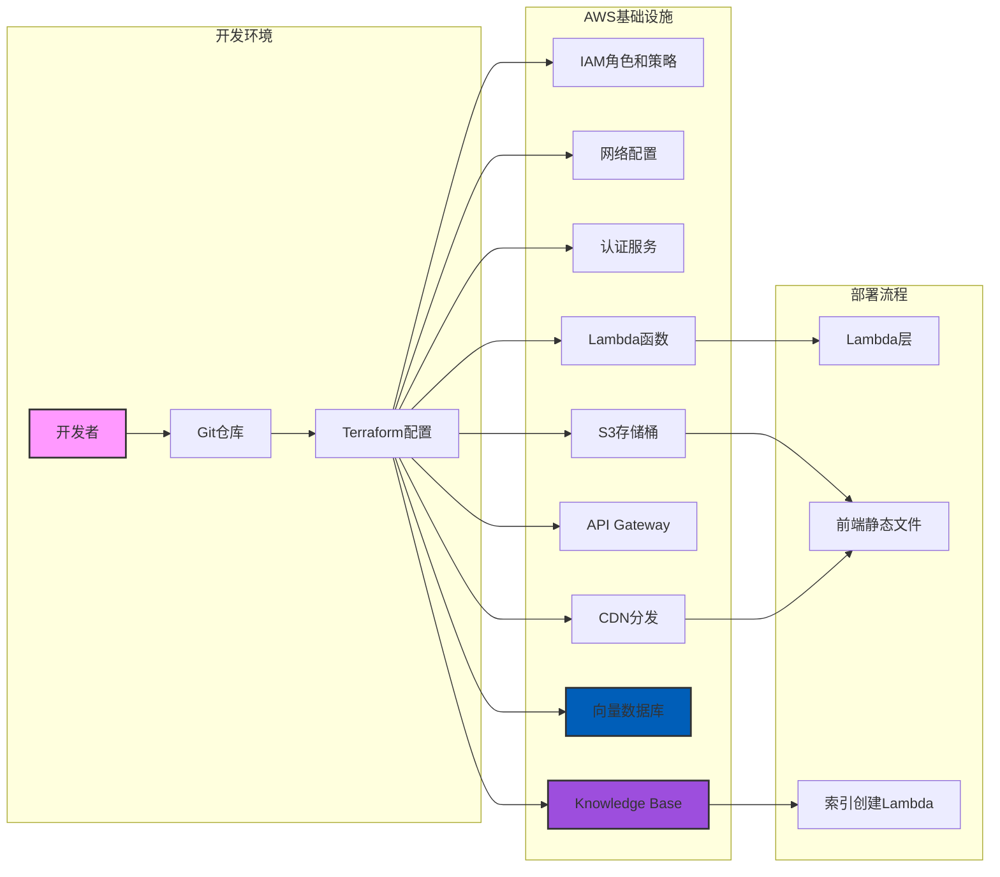
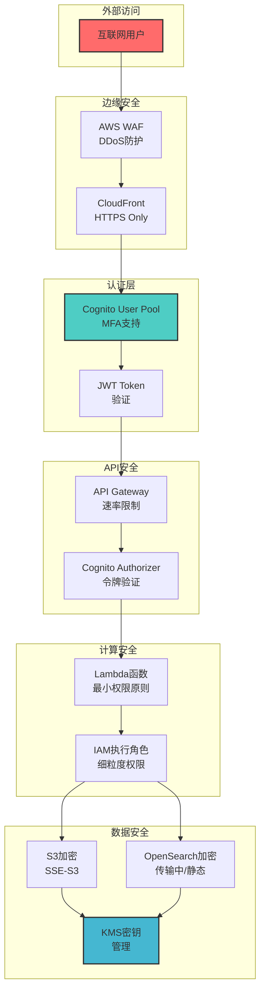
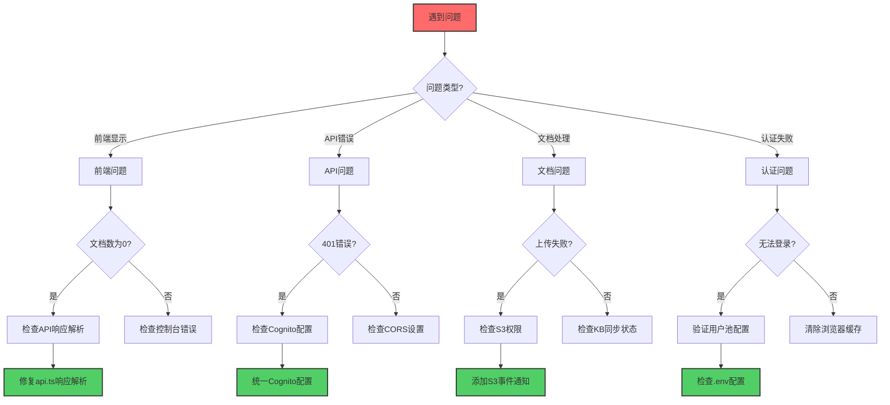
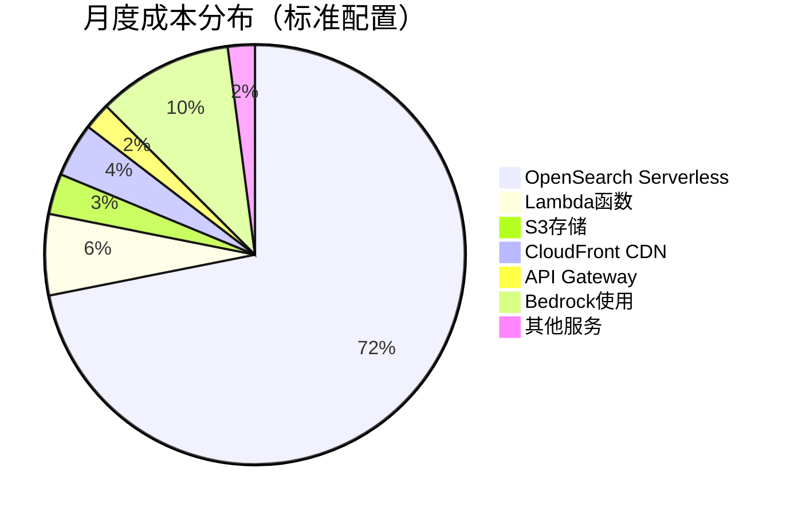
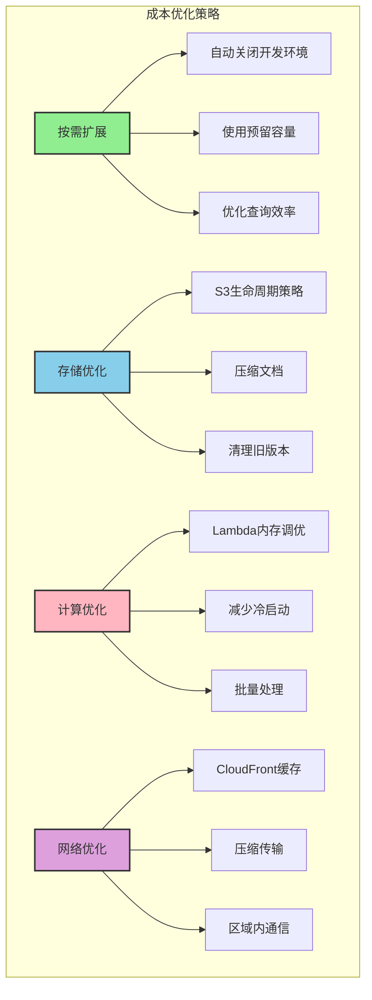
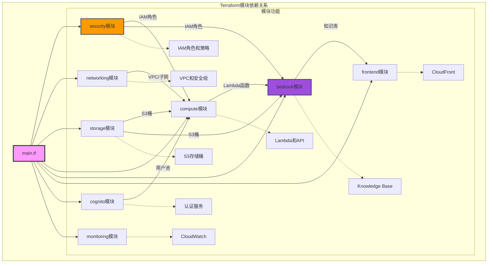

# 基于AWS Nova的企业级RAG知识问答系统

## 🎯 系统概述

这是一个基于AWS Bedrock和Nova模型的企业级RAG（Retrieval-Augmented Generation）知识问答系统，提供云原生、高可用、弹性扩展的解决方案。

### ✅ 核心功能状态
- ✅ **文档上传和管理**: 支持多种格式，自动触发处理
- ✅ **知识库同步**: S3事件通知自动启动ingestion job
- ✅ **实时统计显示**: 动态显示文档数量和类型分布
- ✅ **智能问答**: 基于Nova Pro模型的上下文理解
- ✅ **用户认证**: Cognito集成的安全访问控制
- ✅ **系统监控**: CloudWatch集成的性能监控

### 🆕 最新更新（2025-07-29）
- 🐛 **修复文档显示问题**: 
  - 解决了前端文档数量显示为0的问题
  - 修复了API响应解析逻辑错误
  - 优化了Lambda proxy响应格式处理
- 📊 **修复知识库统计功能**:
  - 移除了硬编码的模拟数据
  - 实现了动态获取真实文档统计
  - 自动计算文件类型分布
- 🔐 **S3事件通知集成**: 
  - 配置了文档上传自动触发处理
  - 解决了Terraform循环依赖问题
  - 添加了IAM权限StartIngestionJob
- 🎯 **认证和API集成优化**:
  - 修复了Cognito授权器配置
  - 统一了前端认证token处理
  - 添加了详细的API调试日志

### 📅 历史更新（2025-07-27）
- 🏗️ **架构优化完成**: 统一模块目录结构，Cognito独立成模块
- ✅ **Bedrock Knowledge Base集成**: 成功实现Terraform自动部署
- 🔧 **OpenSearch索引自动创建**: 通过Lambda自定义资源解决限制
- 📊 **知识库ID**: xxxxx | **数据源ID**: xxxxx

### 核心特性
- 🧠 **AI问答系统**: 基于Amazon Bedrock Nova Pro模型
- 📚 **知识库管理**: OpenSearch Serverless向量数据库
- 💬 **智能对话**: 支持上下文理解的多轮对话
- 📄 **文档处理**: 支持PDF、DOCX、TXT、MD、CSV、JSON格式
- 🔒 **企业级安全**: Cognito认证 + IAM权限管理
- 📊 **实时监控**: CloudWatch Dashboard + 自定义指标

## 🏗️ 系统架构

### 系统组件架构图



### 数据流程图



### 技术栈详情

| 层级 | 技术组件 | 说明 |
|------|----------|------|
| **前端** | React + TypeScript | SPA应用框架 |
| | Material-UI | UI组件库 |
| | AWS Amplify | 认证和API集成 |
| **API** | API Gateway REST | RESTful API服务 |
| | Cognito Authorizer | JWT令牌验证 |
| **计算** | Lambda (Python 3.9) | 无服务器函数 |
| | Bedrock Runtime | AI模型调用 |
| **存储** | S3 | 文档对象存储 |
| | OpenSearch Serverless | 向量数据库 |
| **AI** | Titan Embeddings G1 | 文本向量化(1536维) |
| | Nova Pro | 对话生成模型 |
| **基础设施** | Terraform | IaC部署工具 |
| | CloudWatch | 日志和监控 |

### 部署架构图



### 安全架构图



## 🚀 快速部署

### 前置条件
- AWS账号（需要Bedrock服务权限）
- AWS CLI已配置（`aws configure`）
- Terraform >= 1.0
- Node.js >= 16
- Python 3.9+

### 第一步：启用Bedrock模型
1. 访问 [AWS Bedrock控制台](https://console.aws.amazon.com/bedrock/)
2. 在模型访问页面启用以下模型：
   - Amazon Titan Embeddings G1 - Text
   - Amazon Nova Pro

### 第二步：部署基础设施

```bash
# 1. 克隆项目
git clone https://github.com/yincma/AWS-BEDROCK-RAG.git
cd system-2-aws-bedrock

# 2. 部署基础设施
cd infrastructure/terraform
terraform init
terraform plan
terraform apply -auto-approve

# 部署过程大约需要15-20分钟
# 注意：部署包含以下关键组件：
# - Bedrock Knowledge Base (自动创建)
# - OpenSearch Serverless集合和索引
# - Lambda函数用于索引创建
# - S3数据源配置
```

### 第三步：配置前端环境（可直接访问CloudFront代替此步骤）

```bash
# 1. 回到项目根目录
cd ../..

# 2. 进入前端目录
cd applications/frontend

# 3. 安装依赖
npm install

# 4. 环境变量已自动配置在 .env 文件中
# 如需修改，编辑 .env 文件
```

### 第四步：启动前端应用

```bash
# 在 applications/frontend 目录下
npm start

# 应用将在 http://localhost:3000 启动
```

## 📖 使用指南

### 1. 访问系统
- 本地开发: http://localhost:3000
- 生产环境: https://xxxx.cloudfront.net
- API端点: https://xxxx.amazonaws.com/dev

### 2. 用户注册和登录
- 首次使用需要注册账号
- 使用邮箱注册，需要邮箱验证
- 登录后即可使用所有功能

### 3. 文档管理
- 点击"文档"标签上传知识文档
- 支持的格式：PDF、DOCX、TXT、MD、CSV、JSON
- 上传后系统会自动处理并索引到Bedrock Knowledge Base
- 文档存储在S3，向量化后存储在OpenSearch
- **实时统计**: 侧边栏显示文档总数、文档块数和文件类型分布
- **自动处理**: S3事件通知自动触发Knowledge Base同步

### 4. 智能问答
- 在"对话"标签页提问
- 系统通过Bedrock Knowledge Base检索相关文档
- 使用Nova Pro模型生成准确答案
- 支持上下文关联的多轮对话

### 5. 系统监控
- "监控"标签页查看系统状态
- 包括文档处理状态、API性能等

## 🧹 系统清理

当需要完全移除系统时，请按以下步骤操作：

### 手动清理步骤（推荐）

如果自动清理失败，请按以下步骤手动清理：

```bash
# 1. 清理Terraform资源
cd infrastructure/terraform
terraform destroy -auto-approve

# 2. 如果有资源无法删除，检查并手动删除
# 列出所有标记为enterprise-rag的资源
aws resourcegroupstaggingapi get-resources \
  --tag-filters Key=Project,Values=enterprise-rag \
  --query "ResourceTagMappingList[].ResourceARN"

# 3. 清理可能遗留的S3存储桶
aws s3 ls | grep enterprise-rag
# 对每个存储桶执行：
# aws s3 rm s3://BUCKET_NAME --recursive
# aws s3 rb s3://BUCKET_NAME

# 4. 清理Bedrock Knowledge Base（如果需要）
# aws bedrock-agent delete-data-source \
#   --knowledge-base-id XXXXX \
#   --data-source-id U9KR3CVD7H
# aws bedrock-agent delete-knowledge-base \
#   --knowledge-base-id XXXXX
```

### 验证清理

```bash
# 检查Lambda函数
aws lambda list-functions --query "Functions[?contains(FunctionName, 'enterprise-rag')]"

# 检查API Gateway
aws apigateway get-rest-apis --query "items[?contains(name, 'enterprise-rag')]"

# 检查S3存储桶
aws s3 ls | grep enterprise-rag

# 检查CloudFront
aws cloudfront list-distributions --query "DistributionList.Items[?Comment=='RAG Frontend Distribution']"

# 检查OpenSearch Serverless
aws opensearchserverless list-collections --query "collectionDetails[?name=='enterprise-rag-kb-collection-dev']"

# 检查Bedrock Knowledge Base
aws bedrock-agent list-knowledge-bases --query "knowledgeBaseSummaries[?name=='enterprise-rag-knowledge-base-dev']"
```

## 🛠️ 故障排除

### 故障诊断流程图



### 文档数量显示为0的问题
**症状**: 前端显示"知识库文档 (0)"，即使后端有文档

**原因**: API响应解析逻辑错误，未正确处理嵌套的data字段

**解决方案**:
```javascript
// 修复前端API响应解析 (api.ts)
// 对于非Lambda proxy格式的响应
data: data.success !== false ? (data.data !== undefined ? data.data : data) : undefined
```

### 知识库统计显示硬编码数据
**症状**: 侧边栏显示固定的35个文档和1250个文档块

**解决方案**: 更新MainLayout.tsx的refreshKbStats函数，从真实API获取数据：
```javascript
const documentsResponse = await apiService.getDocuments();
const statusResponse = await apiService.getKnowledgeBaseStatus();
```

### S3文档上传后未自动处理
**症状**: 文档上传成功但Knowledge Base未更新

**原因**: 缺少S3事件通知配置

**解决方案**:
1. 在storage模块添加S3 bucket notification
2. 解决Terraform循环依赖：传递Lambda名称而非ARN
3. 添加IAM权限：`bedrock:StartIngestionJob`

### OpenSearch元数据映射错误
**症状**: `object mapping for [metadata] tried to parse field [metadata] as object, but found a concrete value`

**解决方案**: 在index_creator Lambda中设置metadata字段mapping：
```python
"metadata": {
    "type": "object",
    "enabled": False  # 关键设置
}
```

### API返回401 Unauthorized
**症状**: 前端调用API时收到401错误

**检查步骤**:
1. 验证Cognito配置是否一致
2. 检查前端是否正确获取ID Token
3. 确认API Gateway配置了Cognito授权器

**调试方法**:
```javascript
// 在浏览器控制台检查认证状态
const { fetchAuthSession } = await import('aws-amplify/auth');
const session = await fetchAuthSession();
console.log('ID Token:', session.tokens?.idToken?.toString());
```

### Cognito配置不一致
**症状**: 环境变量和config.json中的User Pool ID不同

**解决方案**: 确保.env文件和config.json使用相同的Cognito配置

### CORS错误
如果遇到CORS错误：
```bash
# 重新部署API Gateway
aws apigateway create-deployment --rest-api-id YOUR_API_ID --stage-name dev
```

### Knowledge Base同步问题
如果文档没有被正确索引：
```bash
# 手动触发数据源同步
aws bedrock-agent start-ingestion-job \
  --knowledge-base-id xxxxx \
  --data-source-id xxxxx

# 检查同步状态
aws bedrock-agent list-ingestion-jobs \
  --knowledge-base-id xxxxx \
  --data-source-id xxxxx \
  --max-results 5
```

### 前端构建警告
忽略ESLint未使用变量的警告，这些不影响功能：
```bash
npm run build
# 警告可以忽略，不影响部署
```

## 💰 成本估算

### 成本分布图



### 成本优化架构



### 最小配置（开发/测试）
- 月成本：约 $180-250
- 包括：Lambda、S3、API Gateway基础使用
- OpenSearch Serverless最低成本

### 标准配置（小团队）
- 月成本：约 $250-400
- 包括：适度的查询量和文档存储
- 标准OpenSearch配置

### 生产配置（企业）
- 月成本：约 $400-800
- 包括：高可用性、监控、备份
- 扩展的OpenSearch容量

### 主要成本来源
1. **OpenSearch Serverless**: 最低2个OCU（~$345/月）- 最大成本项
2. **Bedrock**: 
   - Nova Pro: ~$0.00075/1K输入令牌, $0.003/1K输出令牌
   - Titan Embeddings: ~$0.0001/1K令牌
3. **Lambda**: 按请求和执行时间计费（~$20-50/月）
4. **S3**: 存储和请求费用（~$5-20/月）
5. **CloudFront**: 数据传输费用（~$10-30/月）

### 成本监控命令
```bash
# 查看当前月成本
aws ce get-cost-and-usage \
    --time-period Start=2025-07-01,End=2025-07-31 \
    --granularity MONTHLY \
    --metrics "UnblendedCost" \
    --group-by Type=DIMENSION,Key=SERVICE

# 设置成本告警
aws cloudwatch put-metric-alarm \
    --alarm-name "RAG-Monthly-Cost-Alert" \
    --alarm-description "Alert when monthly cost exceeds $500" \
    --metric-name EstimatedCharges \
    --namespace AWS/Billing \
    --statistic Maximum \
    --period 86400 \
    --threshold 500 \
    --comparison-operator GreaterThanThreshold
```

## 🚀 性能优化建议

### API响应优化
- 使用批量操作减少API调用次数
- 实现前端缓存避免重复请求
- 合理设置重试策略和超时时间

### 文档处理优化
- 批量上传文档以减少同步次数
- 使用S3事件通知实现自动处理
- 监控ingestion job状态避免重复处理

### 前端性能
- 使用React.memo避免不必要的重渲染
- 实现虚拟滚动处理大量文档列表
- 优化bundle大小，启用代码分割

## 📊 监控和维护

### 查看系统状态
```bash
# 查看Lambda日志
aws logs tail /aws/lambda/enterprise-rag-query-handler-dev --follow

# 查看Knowledge Base状态
aws bedrock-agent get-knowledge-base --knowledge-base-id xxxxx

# 查看数据源同步状态
aws bedrock-agent list-ingestion-jobs \
  --knowledge-base-id xxxxx \
  --data-source-id xxxxxx

# 查看API Gateway指标
aws cloudwatch get-metric-statistics \
  --namespace AWS/ApiGateway \
  --metric-name Count \
  --dimensions Name=ApiName,Value=enterprise-rag-dev \
  --statistics Sum \
  --start-time 2025-07-25T00:00:00Z \
  --end-time 2025-07-26T00:00:00Z \
  --period 3600
```

### 定期维护任务
1. 检查CloudWatch日志的存储使用
2. 审查IAM权限和访问日志
3. 更新依赖包和安全补丁
4. 监控成本趋势

## 🛠️ 开发指南

### 基础设施开发

本项目采用模块化的Terraform架构，每个模块负责特定的功能域：



### 模块说明

- **cognito/**: 独立的认证服务模块，包含用户池和客户端配置
- **security/**: 安全基础设施（IAM角色、安全组、KMS密钥）
- **compute/**: 计算资源（Lambda、API Gateway、Layers）
- **storage/**: 存储服务（S3桶配置）
- **bedrock/**: Bedrock知识库和AI服务
- **networking/**: VPC和网络配置
- **monitoring/**: CloudWatch监控和告警
- **optimization/**: 性能和成本优化模块

详细的模块映射关系请参考：`infrastructure/terraform/modules/BUSINESS_MAPPING.md`

### 添加新功能

1. 确定功能属于哪个模块
2. 在对应模块中添加资源
3. 更新模块的outputs和variables
4. 在main.tf中引用新功能
5. 更新文档

## 🧪 测试工具

项目包含以下测试工具：

### 认证测试页面
访问 `/auth-test` 路径可以测试认证和API集成：
- 显示当前用户登录状态
- 展示认证token信息
- 测试API端点连接
- 调试API响应格式

### 命令行测试
```bash
# API集成测试
./scripts/test/api-integration-test.sh

# 前端测试
cd applications/frontend
npm test
npm run test:e2e

# Terraform配置验证
cd infrastructure/terraform
terraform validate
terraform plan
```

## 📚 项目结构

```
system-2-aws-bedrock/
├── applications/          # 应用程序代码
│   ├── frontend/         # React前端
│   └── backend/          # Lambda函数
├── infrastructure/       # 基础设施
│   └── terraform/        # Terraform配置
│       ├── main.tf      # 主配置文件
│       ├── modules/     # 模块化基础设施
│       │   ├── cognito/         # 认证服务（独立模块）
│       │   ├── security/        # 安全资源（IAM、KMS、SG）
│       │   ├── networking/      # 网络配置
│       │   ├── storage/         # S3存储
│       │   ├── compute/         # Lambda和API Gateway
│       │   ├── bedrock/         # Bedrock服务
│       │   ├── monitoring/      # CloudWatch监控
│       │   ├── frontend/        # 前端部署
│       │   └── optimization/    # 优化模块集合
│       └── BUSINESS_MAPPING.md  # 业务-技术映射文档
├── scripts/              # 实用脚本
│   ├── deploy/          # 部署脚本
│   └── test/            # 测试脚本
├── docs/                 # 文档
└── tests/                # 测试代码
```

## 🔍 已知限制和计划改进

### 当前限制
- OpenSearch Serverless最低成本较高（2 OCU起步）
- 文档块数量基于估算（每文档约5块）
- Cognito配置需要手动同步环境变量
- 大文件上传可能超时（建议<50MB）

## 🤝 贡献指南

1. Fork项目
2. 创建功能分支 (`git checkout -b feature/amazing-feature`)
3. 提交更改 (`git commit -m 'Add amazing feature'`)
4. 推送到分支 (`git push origin feature/amazing-feature`)
5. 创建Pull Request

## 📄 许可证

MIT License

## 📞 支持

- 问题报告: GitHub Issues

---

**版本**: v2.4.0  
**最后更新**: 2025-07-29  
**状态**: 生产就绪

---

### 📝 文档版本历史

| 版本 | 日期 | 主要更新 |
|------|------|----------|
| v2.4.0 | 2025-07-29 | - 添加mermaid架构图<br/>- 添加数据流程图<br/>- 更新故障排除指南<br/>- 添加成本分析图表 |
| v2.3.0 | 2025-07-27 | - 架构优化完成<br/>- Bedrock KB集成<br/>- OpenSearch自动创建 |
| v2.0.0 | 2025-07-25 | - 初始版本发布<br/>- 基础RAG功能实现 |

### 🎯 快速链接
- 🧪 **认证测试**: https://xxxxxx.cloudfront.net/auth-test
