# Enterprise RAG Knowledge Q&A System Based on AWS Nova

## 🎯 System Overview

This is an enterprise-grade RAG (Retrieval-Augmented Generation) knowledge Q&A system based on AWS Bedrock and Nova models, providing cloud-native, highly available, and elastically scalable solutions.

### ✅ Core Feature Status
- ✅ **Document Upload and Management**: Supports multiple formats with automatic processing
- ✅ **Knowledge Base Sync**: S3 event notifications automatically trigger ingestion jobs
- ✅ **Real-time Statistics Display**: Dynamic display of document count and type distribution
- ✅ **Intelligent Q&A**: Context understanding based on Nova Pro model
- ✅ **User Authentication**: Secure access control with Cognito integration
- ✅ **System Monitoring**: Performance monitoring with CloudWatch integration

### 🆕 Latest Updates (2025-07-29)
- 🐛 **Fixed Document Display Issues**: 
  - Resolved frontend document count showing 0
  - Fixed API response parsing logic errors
  - Optimized Lambda proxy response format handling
- 📊 **Fixed Knowledge Base Statistics**:
  - Removed hardcoded mock data
  - Implemented dynamic retrieval of real document statistics
  - Automatic calculation of file type distribution
- 🔐 **S3 Event Notification Integration**: 
  - Configured automatic processing trigger for document uploads
  - Resolved Terraform circular dependency issues
  - Added IAM permission StartIngestionJob
- 🎯 **Authentication and API Integration Optimization**:
  - Fixed Cognito authorizer configuration
  - Unified frontend authentication token handling
  - Added detailed API debug logging

### 📅 Historical Updates (2025-07-27)
- 🏗️ **Architecture Optimization Complete**: Unified module directory structure, Cognito as independent module
- ✅ **Bedrock Knowledge Base Integration**: Successfully implemented Terraform auto-deployment
- 🔧 **OpenSearch Index Auto-creation**: Resolved limitations through Lambda custom resources
- 📊 **Knowledge Base ID**: CY2M1N3MQM | **Data Source ID**: ICVLMBD5AZ

### Core Features
- 🧠 **AI Q&A System**: Based on Amazon Bedrock Nova Pro model
- 📚 **Knowledge Base Management**: OpenSearch Serverless vector database
- 💬 **Intelligent Dialogue**: Multi-turn conversations with context understanding
- 📄 **Document Processing**: Supports PDF, DOCX, TXT, MD, CSV, JSON formats
- 🔒 **Enterprise Security**: Cognito authentication + IAM permission management
- 📊 **Real-time Monitoring**: CloudWatch Dashboard + custom metrics

## 🏗️ System Architecture

### System Component Architecture Diagram

```mermaid
graph TB
    %% User Layer
    User[👤 User] --> CF[CloudFront CDN]
    CF --> React[React Frontend<br/>Amplify Integration]
    
    %% API Layer
    React --> APIGW[API Gateway REST]
    APIGW --> CogAuth[Cognito Authorizer]
    
    %% Lambda Function Layer
    APIGW --> QueryLambda[Query Handler Lambda]
    APIGW --> DocLambda[Document Processor Lambda]
    APIGW --> UploadLambda[Upload Handler Lambda]
    APIGW --> StatusLambda[Status Handler Lambda]
    
    %% Storage Layer
    UploadLambda --> S3Docs[(S3 Document Storage)]
    S3Docs --> S3Event[S3 Event Notification]
    S3Event --> DocLambda
    
    %% Bedrock Knowledge Base
    DocLambda --> KBIngest[Knowledge Base<br/>Ingestion Job]
    QueryLambda --> KBQuery[Knowledge Base<br/>Query API]
    
    subgraph Bedrock Knowledge Base
        DataSource[Data Source<br/>ICVLMBD5AZ]
        OpenSearch[(OpenSearch<br/>Serverless<br/>Vector DB)]
        TitanEmbed[Titan Embeddings<br/>G1 Model]
        NovaModel[Nova Pro<br/>LLM Model]
        
        DataSource --> OpenSearch
        TitanEmbed --> OpenSearch
        OpenSearch --> NovaModel
    end
    
    KBIngest --> DataSource
    KBQuery --> OpenSearch
    
    %% Authentication Flow
    subgraph Cognito
        UserPool[User Pool]
        AppClient[App Client]
    end
    
    React -.->|Authentication| UserPool
    CogAuth --> UserPool
    
    %% Monitoring
    CloudWatch[CloudWatch<br/>Logs & Metrics]
    QueryLambda -.-> CloudWatch
    DocLambda -.-> CloudWatch
    
    style User fill:#f9f,stroke:#333,stroke-width:2px
    style React fill:#61dafb,stroke:#333,stroke-width:2px
    style APIGW fill:#ff9900,stroke:#333,stroke-width:2px
    style OpenSearch fill:#005EB8,stroke:#333,stroke-width:2px
    style NovaModel fill:#9d4edd,stroke:#333,stroke-width:2px
```



### Data Flow Diagram


### Technology Stack Details

| Layer | Technology Component | Description |
|-------|---------------------|-------------|
| **Frontend** | React + TypeScript | SPA application framework |
| | Material-UI | UI component library |
| | AWS Amplify | Authentication and API integration |
| **API** | API Gateway REST | RESTful API service |
| | Cognito Authorizer | JWT token validation |
| **Compute** | Lambda (Python 3.9) | Serverless functions |
| | Bedrock Runtime | AI model invocation |
| **Storage** | S3 | Document object storage |
| | OpenSearch Serverless | Vector database |
| **AI** | Titan Embeddings G1 | Text vectorization (1536 dimensions) |
| | Nova Pro | Conversational generation model |
| **Infrastructure** | Terraform | IaC deployment tool |
| | CloudWatch | Logging and monitoring |

### Deployment Architecture Diagram


### Security Architecture Diagram


## 🚀 Quick Deployment

### Prerequisites
- AWS account (with Bedrock service permissions)
- AWS CLI configured (`aws configure`)
- Terraform >= 1.0
- Node.js >= 16
- Python 3.9+

### Step 1: Enable Bedrock Models
1. Visit [AWS Bedrock Console](https://console.aws.amazon.com/bedrock/)
2. Enable the following models on the model access page:
   - Amazon Titan Embeddings G1 - Text
   - Amazon Nova Pro

### Step 2: Deploy Infrastructure

```bash
# 1. Clone the project
git clone https://github.com/yincma/AWS-BEDROCK-RAG.git
cd system-2-aws-bedrock

# 2. Deploy infrastructure
cd infrastructure/terraform
terraform init
terraform plan
terraform apply -auto-approve

# The deployment process takes approximately 15-20 minutes
# Note: Deployment includes the following key components:
# - Bedrock Knowledge Base (auto-created)
# - OpenSearch Serverless collection and index
# - Lambda functions for index creation
# - S3 data source configuration
```

### Step 3: Configure Frontend Environment (Optional - can use CloudFront directly)

```bash
# 1. Return to project root directory
cd ../..

# 2. Enter frontend directory
cd applications/frontend

# 3. Install dependencies
npm install

# 4. Environment variables are automatically configured in .env file
# Edit .env file if modifications are needed
```

### Step 4: Start Frontend Application

```bash
# In applications/frontend directory
npm start

# Application will start at http://localhost:3000
```

## 📖 Usage Guide

### 1. System Access
- Local development: http://localhost:3000
- Production environment: https://xxxx.cloudfront.net
- API endpoint: https://xxxx.amazonaws.com/dev

### 2. User Registration and Login
- First-time users need to register an account
- Register using email address, email verification required
- After login, all features are accessible

### 3. Document Management
- Click the "Documents" tab to upload knowledge documents
- Supported formats: PDF, DOCX, TXT, MD, CSV, JSON
- After upload, the system automatically processes and indexes to Bedrock Knowledge Base
- Documents are stored in S3, vectorized and stored in OpenSearch
- **Real-time Statistics**: Sidebar displays total documents, document chunks, and file type distribution
- **Auto Processing**: S3 event notifications automatically trigger Knowledge Base sync

### 4. Intelligent Q&A
- Ask questions in the "Chat" tab
- System retrieves relevant documents through Bedrock Knowledge Base
- Uses Nova Pro model to generate accurate answers
- Supports contextual multi-turn conversations

### 5. System Monitoring
- View system status in the "Monitoring" tab
- Includes document processing status, API performance, etc.

## 🧹 System Cleanup

When you need to completely remove the system, follow these steps:

### Manual Cleanup Steps (Recommended)

If automatic cleanup fails, please follow these manual cleanup steps:

```bash
# 1. Clean up Terraform resources
cd infrastructure/terraform
terraform destroy -auto-approve

# 2. If resources cannot be deleted, check and manually delete
# List all resources tagged as enterprise-rag
aws resourcegroupstaggingapi get-resources \
  --tag-filters Key=Project,Values=enterprise-rag \
  --query "ResourceTagMappingList[].ResourceARN"

# 3. Clean up any remaining S3 buckets
aws s3 ls | grep enterprise-rag
# For each bucket, execute:
# aws s3 rm s3://BUCKET_NAME --recursive
# aws s3 rb s3://BUCKET_NAME

# 4. Clean up Bedrock Knowledge Base (if needed)
# aws bedrock-agent delete-data-source \
#   --knowledge-base-id XXXXX \
#   --data-source-id U9KR3CVD7H
# aws bedrock-agent delete-knowledge-base \
#   --knowledge-base-id XXXXX
```

### Verify Cleanup

```bash
# Check Lambda functions
aws lambda list-functions --query "Functions[?contains(FunctionName, 'enterprise-rag')]"

# Check API Gateway
aws apigateway get-rest-apis --query "items[?contains(name, 'enterprise-rag')]"

# Check S3 buckets
aws s3 ls | grep enterprise-rag

# Check CloudFront
aws cloudfront list-distributions --query "DistributionList.Items[?Comment=='RAG Frontend Distribution']"

# Check OpenSearch Serverless
aws opensearchserverless list-collections --query "collectionDetails[?name=='enterprise-rag-kb-collection-dev']"

# Check Bedrock Knowledge Base
aws bedrock-agent list-knowledge-bases --query "knowledgeBaseSummaries[?name=='enterprise-rag-knowledge-base-dev']"
```

## 🛠️ Troubleshooting

### Troubleshooting Flow Diagram


### Document Count Showing 0 Issue
**Symptom**: Frontend displays "Knowledge Base Documents (0)" even when backend has documents

**Cause**: API response parsing logic error, not properly handling nested data fields

**Solution**:
```javascript
// Fix frontend API response parsing (api.ts)
// For non-Lambda proxy format responses
data: data.success !== false ? (data.data !== undefined ? data.data : data) : undefined
```

### Knowledge Base Statistics Showing Hardcoded Data
**Symptom**: Sidebar displays fixed 35 documents and 1250 document chunks

**Solution**: Update MainLayout.tsx's refreshKbStats function to get data from real API:
```javascript
const documentsResponse = await apiService.getDocuments();
const statusResponse = await apiService.getKnowledgeBaseStatus();
```

### S3 Document Upload Not Auto-Processing
**Symptom**: Document upload successful but Knowledge Base not updated

**Cause**: Missing S3 event notification configuration

**Solution**:
1. Add S3 bucket notification in storage module
2. Resolve Terraform circular dependency: pass Lambda name instead of ARN
3. Add IAM permission: `bedrock:StartIngestionJob`

### OpenSearch Metadata Mapping Error
**Symptom**: `object mapping for [metadata] tried to parse field [metadata] as object, but found a concrete value`

**Solution**: Set metadata field mapping in index_creator Lambda:
```python
"metadata": {
    "type": "object",
    "enabled": False  # Key setting
}
```

### API Returns 401 Unauthorized
**Symptom**: Frontend receives 401 error when calling API

**Check Steps**:
1. Verify Cognito configuration consistency
2. Check if frontend correctly obtains ID Token
3. Confirm API Gateway has Cognito authorizer configured

**Debug Method**:
```javascript
// Check authentication status in browser console
const { fetchAuthSession } = await import('aws-amplify/auth');
const session = await fetchAuthSession();
console.log('ID Token:', session.tokens?.idToken?.toString());
```

### Cognito Configuration Inconsistency
**Symptom**: User Pool ID differs between environment variables and config.json

**Solution**: Ensure .env file and config.json use the same Cognito configuration

### CORS Errors
If encountering CORS errors:
```bash
# Redeploy API Gateway
aws apigateway create-deployment --rest-api-id YOUR_API_ID --stage-name dev
```

### Knowledge Base Sync Issues
If documents are not properly indexed:
```bash
# Manually trigger data source sync
aws bedrock-agent start-ingestion-job \
  --knowledge-base-id CY2M1N3MQM \
  --data-source-id ICVLMBD5AZ

# Check sync status
aws bedrock-agent list-ingestion-jobs \
  --knowledge-base-id CY2M1N3MQM \
  --data-source-id ICVLMBD5AZ \
  --max-results 5
```

### Frontend Build Warnings
Ignore ESLint unused variable warnings, these don't affect functionality:
```bash
npm run build
# Warnings can be ignored, won't affect deployment
```

## 💰 Cost Estimation

### Cost Distribution Chart


### Cost Optimization Architecture


### Minimal Configuration (Development/Testing)
- Monthly cost: ~$180-250
- Includes: Lambda, S3, API Gateway basic usage
- OpenSearch Serverless minimum cost

### Standard Configuration (Small Team)
- Monthly cost: ~$250-400
- Includes: Moderate query volume and document storage
- Standard OpenSearch configuration

### Production Configuration (Enterprise)
- Monthly cost: ~$400-800
- Includes: High availability, monitoring, backup
- Extended OpenSearch capacity

### Major Cost Sources
1. **OpenSearch Serverless**: Minimum 2 OCUs (~$345/month) - Largest cost item
2. **Bedrock**: 
   - Nova Pro: ~$0.00075/1K input tokens, $0.003/1K output tokens
   - Titan Embeddings: ~$0.0001/1K tokens
3. **Lambda**: Charged by requests and execution time (~$20-50/month)
4. **S3**: Storage and request fees (~$5-20/month)
5. **CloudFront**: Data transfer fees (~$10-30/month)

### Cost Monitoring Commands
```bash
# View current month costs
aws ce get-cost-and-usage \
    --time-period Start=2025-07-01,End=2025-07-31 \
    --granularity MONTHLY \
    --metrics "UnblendedCost" \
    --group-by Type=DIMENSION,Key=SERVICE

# Set cost alerts
aws cloudwatch put-metric-alarm \
    --alarm-name "RAG-Monthly-Cost-Alert" \
    --alarm-description "Alert when monthly cost exceeds $500" \
    --metric-name EstimatedCharges \
    --namespace AWS/Billing \
    --statistic Maximum \
    --period 86400 \
    --threshold 500 \
    --comparison-operator GreaterThanThreshold
```

## 🚀 Performance Optimization Recommendations

### API Response Optimization
- Use batch operations to reduce API call frequency
- Implement frontend caching to avoid duplicate requests
- Set reasonable retry policies and timeout values

### Document Processing Optimization
- Batch upload documents to reduce sync frequency
- Use S3 event notifications for automatic processing
- Monitor ingestion job status to avoid duplicate processing

### Frontend Performance
- Use React.memo to avoid unnecessary re-renders
- Implement virtual scrolling for large document lists
- Optimize bundle size and enable code splitting

## 📊 Monitoring and Maintenance

### Check System Status
```bash
# View Lambda logs
aws logs tail /aws/lambda/enterprise-rag-query-handler-dev --follow

# View Knowledge Base status
aws bedrock-agent get-knowledge-base --knowledge-base-id xxxxx

# View data source sync status
aws bedrock-agent list-ingestion-jobs \
  --knowledge-base-id xxxxx \
  --data-source-id xxxxxx

# View API Gateway metrics
aws cloudwatch get-metric-statistics \
  --namespace AWS/ApiGateway \
  --metric-name Count \
  --dimensions Name=ApiName,Value=enterprise-rag-dev \
  --statistics Sum \
  --start-time 2025-07-25T00:00:00Z \
  --end-time 2025-07-26T00:00:00Z \
  --period 3600
```

### Regular Maintenance Tasks
1. Check CloudWatch log storage usage
2. Review IAM permissions and access logs
3. Update dependencies and security patches
4. Monitor cost trends

## 🛠️ Development Guide

### Infrastructure Development

This project uses a modular Terraform architecture, with each module responsible for a specific functional domain:


### Module Description

- **cognito/**: Independent authentication service module with user pool and client configuration
- **security/**: Security infrastructure (IAM roles, security groups, KMS keys)
- **compute/**: Compute resources (Lambda, API Gateway, Layers)
- **storage/**: Storage services (S3 bucket configuration)
- **bedrock/**: Bedrock Knowledge Base and AI services
- **networking/**: VPC and network configuration
- **monitoring/**: CloudWatch monitoring and alerts
- **optimization/**: Performance and cost optimization modules

For detailed module mapping relationships, refer to: `infrastructure/terraform/modules/BUSINESS_MAPPING.md`

### Adding New Features

1. Determine which module the feature belongs to
2. Add resources in the corresponding module
3. Update module outputs and variables
4. Reference new functionality in main.tf
5. Update documentation

## 🧪 Testing Tools

The project includes the following testing tools:

### Authentication Test Page
Access the `/auth-test` path to test authentication and API integration:
- Display current user login status
- Show authentication token information
- Test API endpoint connections
- Debug API response formats

### Command Line Testing
```bash
# API integration testing
./scripts/test/api-integration-test.sh

# Frontend testing
cd applications/frontend
npm test
npm run test:e2e

# Terraform configuration validation
cd infrastructure/terraform
terraform validate
terraform plan
```

## 📚 Project Structure

```
system-2-aws-bedrock/
├── applications/          # Application code
│   ├── frontend/         # React frontend
│   └── backend/          # Lambda functions
├── infrastructure/       # Infrastructure
│   └── terraform/        # Terraform configuration
│       ├── main.tf      # Main configuration file
│       ├── modules/     # Modular infrastructure
│       │   ├── cognito/         # Authentication service (independent module)
│       │   ├── security/        # Security resources (IAM, KMS, SG)
│       │   ├── networking/      # Network configuration
│       │   ├── storage/         # S3 storage
│       │   ├── compute/         # Lambda and API Gateway
│       │   ├── bedrock/         # Bedrock services
│       │   ├── monitoring/      # CloudWatch monitoring
│       │   ├── frontend/        # Frontend deployment
│       │   └── optimization/    # Optimization module collection
│       └── BUSINESS_MAPPING.md  # Business-technical mapping document
├── scripts/              # Utility scripts
│   ├── deploy/          # Deployment scripts
│   └── test/            # Test scripts
├── docs/                 # Documentation
└── tests/                # Test code
```

## 🔍 Known Limitations and Planned Improvements

### Current Limitations
- OpenSearch Serverless minimum cost is high (starts at 2 OCUs)
- Document chunk count based on estimates (~5 chunks per document)
- Cognito configuration requires manual environment variable sync
- Large file uploads may timeout (recommend <50MB)

## 🤝 Contributing Guidelines

1. Fork the project
2. Create a feature branch (`git checkout -b feature/amazing-feature`)
3. Commit your changes (`git commit -m 'Add amazing feature'`)
4. Push to the branch (`git push origin feature/amazing-feature`)
5. Create a Pull Request

## 📄 License

MIT License

## 📞 Support

- Issue reports: GitHub Issues

---

**Version**: v2.4.0  
**Last Updated**: 2025-07-29  
**Status**: Production Ready

## 🧹 AWS Resource Management

### Unified Cleanup Script
This project provides a unified AWS resource management script `aws-cleanup.sh` that supports resource checking and cleanup functionality.

```bash
# Check resources
./aws-cleanup.sh check

# Clean resources
./aws-cleanup.sh clean

# Check first then clean (default)
./aws-cleanup.sh
```

---

### 📝 Documentation Version History

| Version | Date | Major Updates |
|---------|------|--------------|
| v2.4.0 | 2025-07-29 | - Added mermaid architecture diagrams<br/>- Added data flow diagrams<br/>- Updated troubleshooting guide<br/>- Added cost analysis charts |
| v2.3.0 | 2025-07-27 | - Architecture optimization complete<br/>- Bedrock KB integration<br/>- OpenSearch auto-creation |
| v2.0.0 | 2025-07-25 | - Initial version release<br/>- Basic RAG functionality implementation |

### 🎯 Quick Links
- 🧪 **Authentication Test**: https://xxxxxx.cloudfront.net/auth-test
